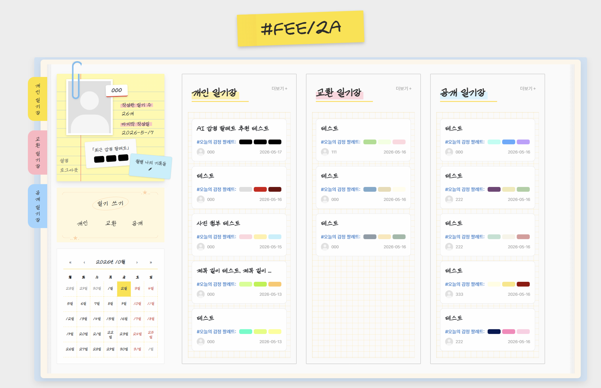
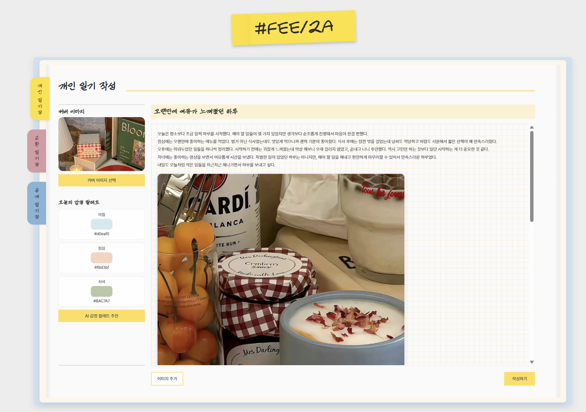
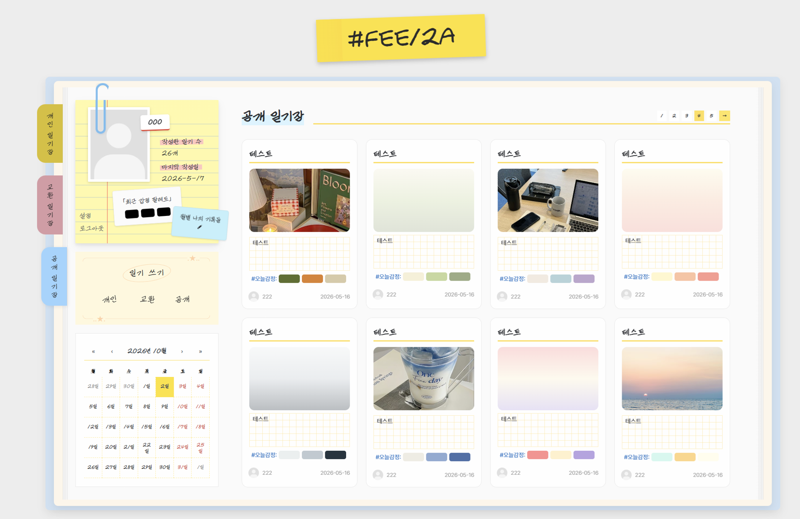
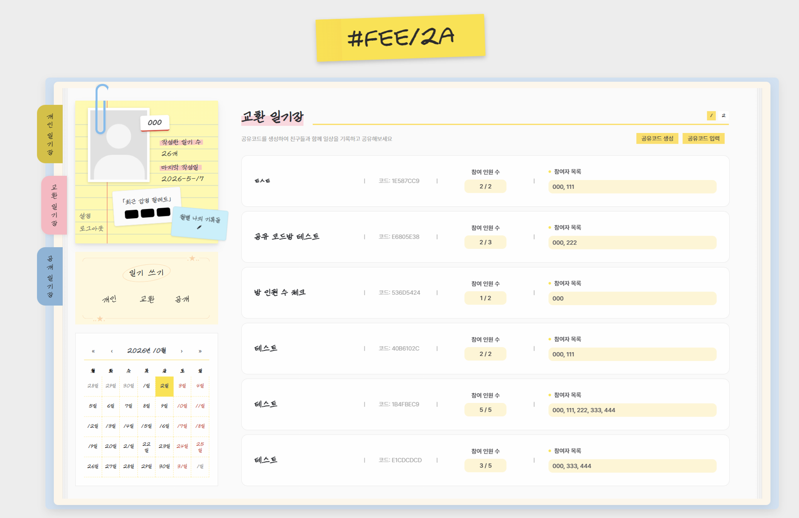
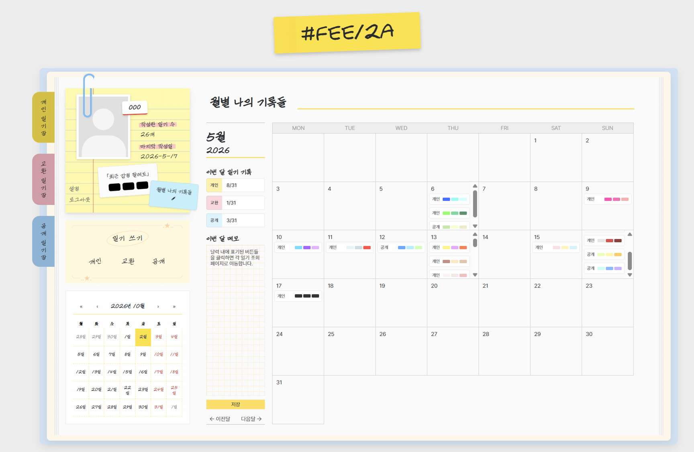

## FEE12A

하루의 감정을 색으로 나타내어 기록하는 다이어리 웹 서비스입니다.

‘#FEE12A’는 사용자가 아침, 점심, 저녁으로 느꼈던 하루의 감정을 글과 색상으로 함께 기록할 수 있도록 기획한 서비스입니다.
기존의 텍스트 중심 일기 서비스와 달리, 감정을 색으로 시각화하여 사용자가 자신의 감정 변화를 직관적으로 확인할 수 있도록 설계했습니다.
또한 AI 분석 기능을 통해 작성한 글의 감정을 분석하고, 그 결과에 맞는 색상을 추천받을 수 있습니다.

---

### 서비스명 의미

“ FEEL TODAY → FEEL2A → #FEE12A ”

'Feel Today'를 간결하게 표현하는 과정에서 FEEL2A로 변형하였고,
최종적으로 감정을 색으로 표현한다는 서비스 컨셉에 맞추어 
HEX Color Code의 알파벳과 숫자들을 조합하여 ‘#FEE12A’라는 이름을 만들었습니다.

---

### 배포 링크

https://feel2a.vercel.app

※ 무료 배포 환경으로 인해 최초 접속 또는 일부 기능 실행 시 응답이 지연될 수 있습니다.

---

### 테스트 계정

아이디 : 000
비밀번호 : 000

※ 사이트 확인용 테스트 계정입니다.

---

### 실행 환경

- 권장 브라우저 : Whale
- 권장 해상도 : 1920 × 1080

※ 본 프로젝트는 데스크톱 환경을 기준으로 제작되었습니다.
(반응형 웹은 지원하지 않으며, 화면 크기에 따라 UI가 다르게 보일 수 있습니다.)

---

### 개발 기간

2026.04.27. ~ 2026.05.18.

---

### 담당 역할

개인 프로젝트 (1인 개발)

- 서비스 기획
- UI/UX 설계
- React 프론트엔드 개발
- Spring Boot 백엔드 개발
- MySQL 데이터베이스 설계
- FastAPI 기반 AI 서버 구축
- Gemini API 연동

---

## 기술 스택

### Frontend

- React
- SCSS
- Axios

### Backend

- Spring Boot
- Spring Security
- JPA
- MySQL

### AI

- FastAPI
- Gemini API

### Tools

- VS Code
- IntelliJ IDEA
- GitHub

---

### 기술 선정 이유

- React
  - 화면을 여러 기능 단위로 나누어 개발하고 관리하기 편리하다고 판단하여 선택

- Spring Boot
  - 회원가입, 로그인, 일기 CRUD 등 서버 기능을 안정적으로 구현하기 위해 선택

- MySQL
  - 사용자 정보와 일기 데이터를 체계적으로 저장하고 관리하기 위해 사용

- FastAPI
  - AI 기능을 별도의 서버로 분리하여 독립적으로 관리하기 위해 사용

- Gemini API
  - 작성한 일기의 감정을 분석하고, 이에 어울리는 색상을 추천하는 기능을 구현하기 위해 사용

---

### 프로젝트 구조

```text
React
 ↓
Spring Boot
 ↙      ↘
MySQL   FastAPI
           ↓
       Gemini API
```

---

## 주요 기능

### 회원 기능

- 회원가입 및 로그인
- Spring Security를 활용한 사용자 인증

### 다이어리 기능

- 공개 / 비공개 / 교환 일기 작성
- 시간대별 감정 색상 선택
- 일기 수정 및 삭제
- 날짜별 일기 조회

### 공유 기능

- 공유 코드 생성
- 다른 사용자와 교환 일기 생성
- 공유 공간 관리

### AI 기능

- Gemini API 기반 감정 분석
- 감정 분석 결과에 따른 색상 추천

---

## 서비스 화면

### 메인 화면


### 일기 작성 화면


### 일기 목록 화면


### 공유 다이어리 화면


### 월별 일기 작성기록 화면


---

## 프로젝트 회고

개인 프로젝트를 진행하던 당시에는 React와 Spring Boot를 활용한 서비스 구현과 AI API 연동에 집중하였습니다.

특히 프론트엔드와 백엔드를 직접 연결하고, AI 기능을 서비스에 적용하는 과정에서 웹 서비스의 전체 개발 흐름을 경험할 수 있었습니다.

다만 당시에는 다양한 디바이스와 해상도를 고려한 반응형 설계 경험이 부족하여 PC 환경 중심으로 화면을 구성하였습니다.

이후 팀 프로젝트를 진행하면서 다양한 화면 크기와 사용자 환경을 고려한 UI/UX 설계의 중요성을 체감하였고, 현재는 반응형 레이아웃과 사용자 접근성을 함께 고려하며 작업하고 있습니다.

이 프로젝트를 통해 기획부터 배포까지의 전 과정을 직접 경험할 수 있었으며,
프론트엔드, 백엔드, AI 기능 연동까지 수행함으로써 웹 서비스 개발에 대한 이해를 넓힐 수 있었습니다.
